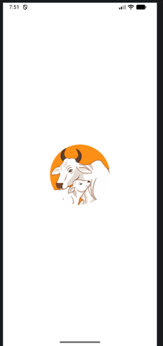
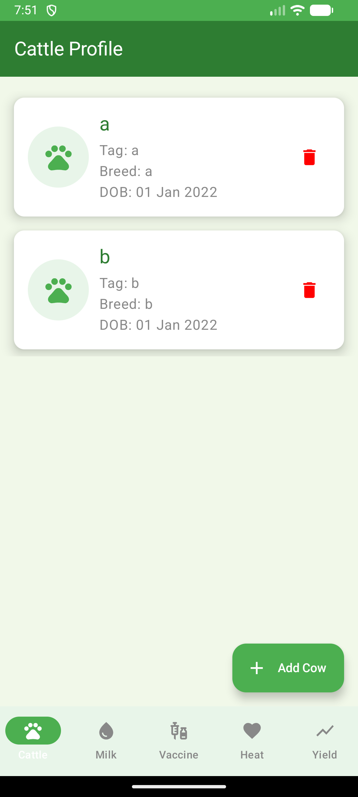
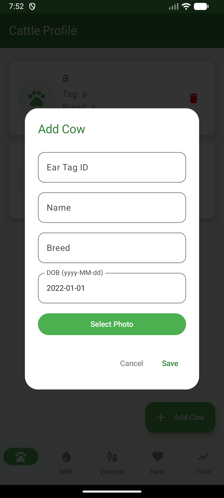
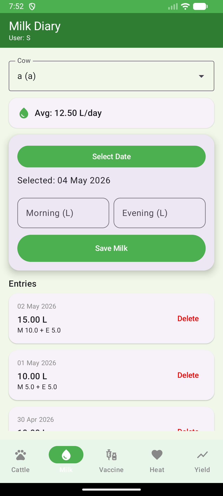
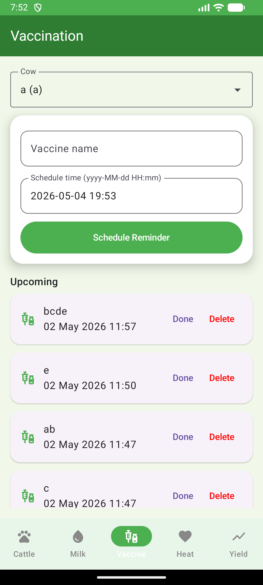
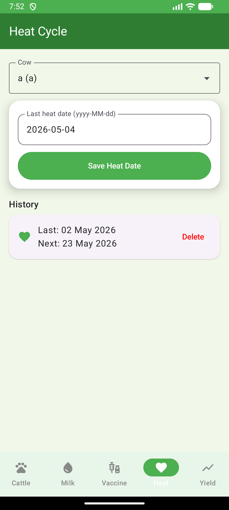
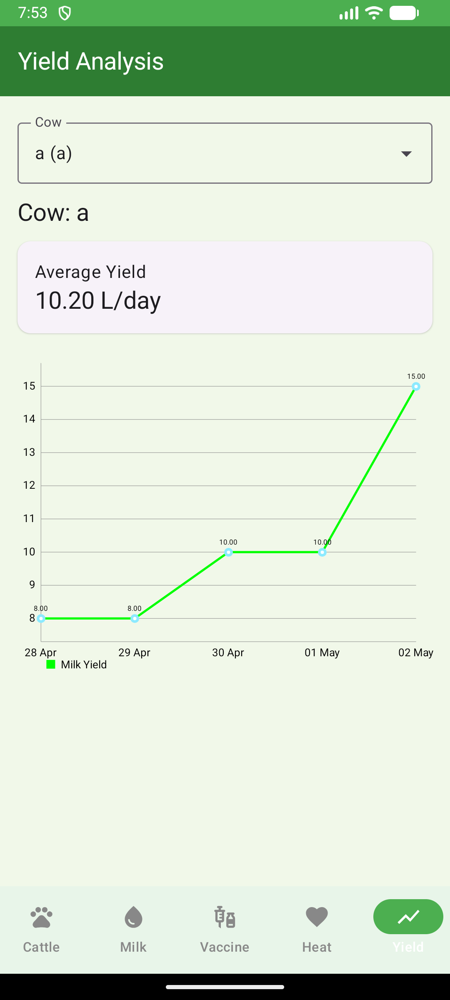

# 🐄 Gokula-Health
### Offline Android Application for Dairy Farmers

Gokula-Health is an offline Android application designed to help dairy farmers manage cattle health, milk production, vaccination schedules, and heat cycle tracking efficiently. The application acts as a digital health card for cattle and supports better livestock management through data-driven monitoring.

---

# Features

* Register and manage cattle profiles
* Add cattle details such as ear tag ID, breed, DOB, and photo
* Record daily milk production (morning and evening)
* Automatic calculation of average milk yield
* Vaccination reminder system using AlarmManager
* Heat cycle tracking and prediction
* Milk yield trend analysis using graphical charts
* Offline functionality using Room Database
* Simple and farmer-friendly UI

---

#  Technologies Used

| Technology           | Purpose                               |
| -------------------- | ------------------------------------- |
| Kotlin               | Android application development       |
| Android Studio       | Development environment               |
| Room Database        | Local offline data storage            |
| MVVM Architecture    | Code organization and maintainability |
| MPAndroidChart       | Milk yield graph visualization        |
| AlarmManager         | Vaccination and heat reminders        |
| Kotlin Coroutines    | Background task handling              |
| LiveData & ViewModel | Lifecycle-aware UI updates            |
| Glide                | Image loading and caching             |
| Material Design 3    | Modern UI components                  |

---

#  Libraries Used

* Room Database
* MPAndroidChart
* AndroidX Libraries
* Material Components
* Lifecycle (ViewModel & LiveData)
* Glide
* RecyclerView
* Kotlin Coroutines

---

#  Modules

## 1. Splash Screen

Displays the application logo and initializes required components.

## 2. Cattle Profile Module

Allows users to add, update, view, and delete cattle records.

## 3. Milk Diary Module

Stores daily milk yield data and calculates average productivity.

## 4. Vaccination Module

Schedules vaccination reminders and tracks upcoming events.

## 5. Heat Cycle Module

Tracks breeding cycles and predicts upcoming heat dates.

## 6. Yield Analysis Module

Displays graphical analysis of milk production trends.

---

#  Project Structure

```plaintext
GokulaHealth/
│
├── .gradle/                         
├── .idea/                           
├── app/
│   │
│   ├── build/                       
│   ├── libs/                        
│   ├── src/
│   │   ├── main/
│   │   │   │
│   │   │   ├── java/com/example/gokula/health/
│   │   │   │   │
│   │   │   │   ├── data/
│   │   │   │   │   ├── AppDatabase.kt
│   │   │   │   │   ├── Cow.kt
│   │   │   │   │   ├── CowDao.kt
│   │   │   │   │   ├── MilkEntry.kt
│   │   │   │   │   ├── MilkDao.kt
│   │   │   │   │   ├── Vaccination.kt
│   │   │   │   │   ├── VaccinationDao.kt
│   │   │   │   │   ├── HeatCycle.kt
│   │   │   │   │   └── HeatDao.kt
│   │   │   │   │
│   │   │   │   ├── navigation/
│   │   │   │   │   └── GokulaNavHost.kt
│   │   │   │   │
│   │   │   │   ├── notifications/
│   │   │   │   │   ├── AlarmScheduler.kt
│   │   │   │   │   └── VaccinationAlarmReceiver.kt
│   │   │   │   │
│   │   │   │   ├── ui/
│   │   │   │   │   ├── components/
│   │   │   │   │   │   └── CowPicker.kt
│   │   │   │   │   │
│   │   │   │   │   ├── screens/
│   │   │   │   │   │   ├── CattleScreen.kt
│   │   │   │   │   │   ├── MilkScreen.kt
│   │   │   │   │   │   ├── VaccinationScreen.kt
│   │   │   │   │   │   ├── HeatScreen.kt
│   │   │   │   │   │   └── YieldScreen.kt
│   │   │   │   │   │
│   │   │   │   │   └── theme/
│   │   │   │   │       ├── Color.kt
│   │   │   │   │       ├── Theme.kt
│   │   │   │   │       └── Type.kt
│   │   │   │   │
│   │   │   │   ├── viewmodel/
│   │   │   │   │   ├── CowViewModel.kt
│   │   │   │   │   ├── MilkViewModel.kt
│   │   │   │   │   ├── VaccinationViewModel.kt
│   │   │   │   │   ├── HeatViewModel.kt
│   │   │   │   │   └── ViewModelFactory.kt
│   │   │   │   │
│   │   │   │   ├── GokulaApp.kt
│   │   │   │   └── MainActivity.kt
│   │   │   │
│   │   │   ├── res/
│   │   │   │   ├── drawable/
│   │   │   │   ├── values/
│   │   │   │   ├── xml/
│   │   │   │   └── mipmap/
│   │   │   │
│   │   │   └── AndroidManifest.xml
│   │   │
│   │   └── test/
│   │
│   ├── build.gradle.kts
│   └── proguard-rules.pro
│
├── gradle/
├── build.gradle.kts
├── settings.gradle.kts
├── gradle.properties
├── gradlew
├── gradlew.bat
├── .gitignore
└── README.md
```

---

#  Database

The application uses Room Database for storing:

* Cattle details
* Milk entries
* Vaccination schedules
* Heat cycle records

All data is stored locally, enabling offline access.

---

#  Notifications

AlarmManager is used to schedule reminders for:

* Vaccination dates
* Heat cycle alerts

Notifications work even when the app is running in the background.

---

#  Graph Analysis

MPAndroidChart is used to generate line charts for milk yield analysis. Farmers can visually monitor productivity trends over time.

---
# 📷 Screenshots

<p align="center">
  
  
  
</p>

<p align="center">
  
  
  
</p>

<p align="center">
  
</p>

#  How to Run the Gokula-Health Project

## 📋 Prerequisites

Before running the project, ensure the following software is installed:

- Android Studio
- JDK 17
- Android SDK
- Gradle
- Android Emulator or Android Mobile Device

---

#  Method 1: Run the Project Using Android Emulator

## Step 1: Clone the Repository

```bash
git clone https://github.com/sushanthms/GokulaHealth.git
```

Or download the ZIP file and extract it.

---

## Step 2: Open Project in Android Studio

1. Open Android Studio  
2. Click:  
   `Open Project`  
3. Select the `GokulaHealth` folder  
4. Wait for Gradle sync to complete  

---

## Step 3: Create Android Emulator

1. Open:  
   `Tools → Device Manager`  
2. Click:  
   `Create Device`  
3. Select a device (Example: Pixel 6)  
4. Download required Android version if needed  
5. Click `Finish`  

---

## Step 4: Run the Emulator

1. Start the emulator from Device Manager  
2. Click the ▶ Run button in Android Studio  
3. Select the emulator device  
4. The app will install and launch automatically  

---

#  Method 2: Run the Project on Physical Android Mobile (USB Debugging)

## Step 1: Enable Developer Options

On your Android phone:

1. Open:  
   `Settings → About Phone`  
2. Tap `Build Number` 7 times  

You will see:  
`You are now a developer`

---

## Step 2: Enable USB Debugging

1. Open:  
   `Settings → Developer Options`  
2. Enable:  
   `USB Debugging`

---

## Step 3: Connect Mobile to PC

1. Connect the phone using a USB cable  
2. Select `File Transfer Mode`  
3. Allow `USB Debugging Permission` on the phone  

---

## Step 4: Run the Application

1. Open the project in Android Studio  
2. Click ▶ Run  
3. Select your connected mobile device  
4. The app will install and open automatically  

---

#  Method 3: Install APK Directly on Mobile

## Step 1: Build APK

In Android Studio:

```plaintext
Build → Build APK(s)
```

APK location:

```plaintext
app/build/outputs/apk/debug/app-debug.apk
```

---

## Step 2: Transfer APK to Mobile

Transfer the APK using:
- USB cable
- WhatsApp
- Google Drive
- Bluetooth

---

## Step 3: Install APK

1. Open APK file on mobile  
2. Allow `Install from Unknown Sources`  
3. Click `Install`  

The app will install successfully.

---

#  Common Issues & Solutions

| Issue | Solution |
|---|---|
| Gradle sync failed | Check internet connection and SDK installation |
| Device not detected | Enable USB debugging |
| Emulator slow | Increase RAM allocation |
| App not installing | Allow unknown sources permission |

---

#  Successful Execution

After successful installation:
- Splash screen appears
- User can manage cattle profiles
- Milk diary and reminders work offline
- Graphs display milk yield trends successfully

---
# 🛠️ Troubleshooting / Common Issues

## 1. Gradle Sync Failed

### Problem
Project does not build or Gradle sync fails.

### Solution
- Check internet connection
- Install correct Android SDK
- Click:
  ```plaintext
  File → Sync Project with Gradle Files
  ```

---

## 2. Emulator Not Starting

### Problem
Android emulator crashes or runs slowly.

### Solution
- Enable virtualization in BIOS
- Increase RAM allocation
- Use x86 emulator image

---

## 3. Mobile Device Not Detected

### Problem
Android Studio does not detect mobile device.

### Solution
- Enable USB Debugging
- Use data cable instead of charging cable
- Install USB drivers

---

## 4. Notifications Not Working

### Problem
Vaccination reminders are not showing.

### Solution
- Allow notification permission on the app setting of the app
- Disable battery optimization for app
- Ensure reminder date/time is correct

---

## 5. App Crashes During Startup

### Problem
Application crashes on launch.

### Solution
- Clean and rebuild project
- Check Room Database version
- Verify dependencies are installed correctly

---

## 6. Graph Not Displaying

### Problem
Milk yield graph is empty.

### Solution
- Add milk records first
- Verify MPAndroidChart dependency
- Restart the app

---

## 7. Data Not Saving

### Problem
Cow or milk data is not stored.

### Solution
- Check Room Database implementation
- Ensure required fields are filled
- Verify DAO methods are working correctly

---

## 8. APK Installation Failed

### Problem
APK does not install on mobile.

### Solution
- Enable “Install from Unknown Sources”
- Check Android version compatibility
- Rebuild APK and try again
---

#  Future Enhancements

* Cloud backup and synchronization
* Veterinary consultation integration
* AI-based cattle health prediction
* Multi-user support
* Voice assistant support

---

#  Developer

Developed by Sushanth M S

---
